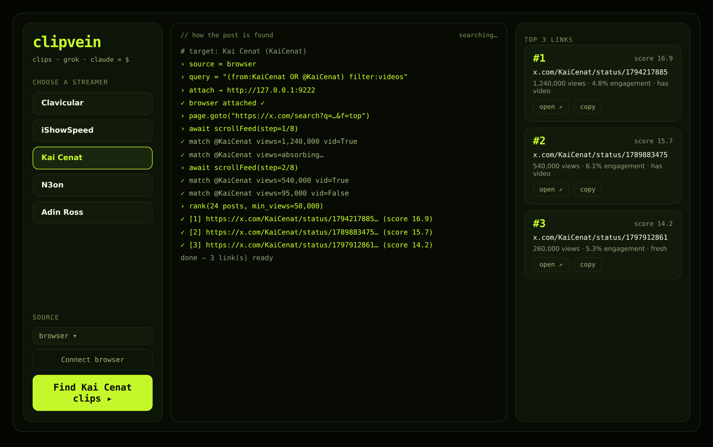

<div align="center">

# ▍clipvein

### `clips · grok · claude = $`

**Mine the X feed for streamer clips that are already going viral, rank what's worth reposting, and turn it into a repeatable content engine.**

ClipVein attaches to *your own* Chrome, reads the live For You feed the way you already scroll it, and hands you the 3 links most worth clipping — with a transparent score that tells you *why* each one made the cut.

[Quickstart](#-quickstart) · [How it works](#-how-it-works) · [Grok + Claude](#-grok--claude-the---half) · [Make money with it](docs/MONETIZATION.md) · [FAQ](docs/FAQ.md)



</div>

---

## ▍What this is

The streamer-clip economy is huge and it runs on one boring truth: **a clip that already popped off once will pop off again** when it's re-cut, re-captioned and re-posted to a fresh audience. Finding those clips by hand is the slow part — endless scrolling, guessing what has legs, missing the window while a moment is hot.

ClipVein automates *the finding*. It:

- **watches the live For You feed through your own logged-in Chrome** — no scraping API, no login theft, no rate-limit bills;
- **keeps only posts that clear a real bar** — the streamer is actually in the post, views are over a floor you set, video is present (clippable);
- **ranks the survivors with an honest score** — reach, engagement rate, video, freshness — and shows the reasons next to each link;
- **optionally calls Grok** to scout the firehose for you, and **Claude** to write the caption — the `= $` half of the loop.

It's a desktop app (PySide6) *and* a CLI. Same engine, same output, whichever you prefer.

> **What ClipVein is not.** It doesn't buy views, run bots, or fake engagement. It finds real moments that are already working and helps you move fast. The money comes from *your* reposts earning real, original views — see [MONETIZATION.md](docs/MONETIZATION.md).

---

## ▍Quickstart

Needs **Python 3.10+**. Windows / macOS / Linux.

```bash
git clone https://github.com/grovenx/clipvein.git
cd clipvein
pip install -r requirements.txt
playwright install chromium   # fallback browser engine, optional
```

### See it work instantly (demo, no browser, no keys)

```bash
python -m clipvein.cli --streamer "Kai Cenat" --source mock
```

or launch the desktop app:

```bash
# Windows (cmd)
set CLIPVEIN_SOURCE=mock && python -m clipvein
# macOS / Linux
CLIPVEIN_SOURCE=mock python -m clipvein
```

A window opens: pick a streamer on the left → **Find clips ▸** → the middle
console animates *how* each post is found → the right column fills with the
top 3 links, each with a score and the reasons behind it.

### Read the real feed

```bash
python -m clipvein          # then click "Connect browser"
```

ClipVein opens a separate Chrome, you sign into X once (the profile is
remembered), and every search after that reads your live feed. Full walk-through in [HOW_TO_RUN.md](HOW_TO_RUN.md).

---

## ▍How it works

```
 choose streamer
        │
        ▼
 attach to YOUR Chrome  ──►  open For You feed  ──►  scroll & extract posts
        │                                                     │
        │                                    ┌────────────────┘
        ▼                                    ▼
 keep post IF:  streamer is in the text  AND  views > floor  AND  (video = clippable)
        │
        ▼
 rank(reach + engagement_rate + video_bonus + freshness)
        │
        ▼
 top 3 links  ──►  copy  ──►  re-cut & re-caption  ──►  repost  ──►  original views
```

### The score is honest and visible

Every link carries the numbers that produced it, so you're never trusting a black box:

| Signal | What it rewards | Why |
|---|---|---|
| **Reach** | `log10(views)` | A post nobody saw can't be milked — but reach has diminishing returns, so 1M isn't 100× a 10k. |
| **Quality** | engagement rate (interactions ÷ views) | Weeds out bot-inflated view counts that got no real reaction. |
| **Clippability** | a bonus for video | This whole pipeline is about clips. |
| **Freshness** | newer posts favoured | A fresh moment still has room to run. |

Tune the weights in [`clipvein/ranker/score.py`](clipvein/ranker/score.py). Change the streamer roster in [`clipvein/streamers.py`](clipvein/streamers.py).

---

## ▍Grok + Claude — the `= $` half

Both are **optional**. ClipVein works fully in `browser` and `mock` mode with zero keys. Add keys to unlock two upgrades:

- **Grok (xAI)** — instead of scrolling yourself, ask Grok to surface the posts that are already popping off. Grok sits on the live X firehose, so it's a natural scout. Set `CLIPVEIN_SOURCE=grok` and add `XAI_API_KEY`. → [prompts/grok/](prompts/grok/)
- **Claude (Anthropic)** — hand a found post to Claude and it writes the high-retention caption in the two-line emotional-bait format that performs on clip accounts. Add `ANTHROPIC_API_KEY`. → [prompts/claude/](prompts/claude/)

The exact prompts both models receive live in [`prompts/`](prompts/) so you can read, fork and tune them.

---

## ▍Project layout

```
clipvein/
├── clipvein/              # the package
│   ├── engine.py          # ties it together, emits the live event stream
│   ├── config.py          # .env-driven settings, sane defaults
│   ├── models.py          # Post / ScoredPost / SearchResult
│   ├── streamers.py       # the roster in the picker — edit freely
│   ├── browser/           # attach to your Chrome over CDP
│   ├── scraper/           # walk the feed, extract posts + metrics
│   ├── ranker/            # the transparent scoring
│   ├── integrations/      # optional Grok + Claude calls
│   ├── ui/                # PySide6 desktop app
│   └── cli.py             # same engine, in the terminal
├── prompts/               # Grok + Claude prompt library
├── skills/clip-to-cash/   # end-to-end "found post → posted clip" workflow
├── docs/                  # architecture, workflow, monetization, FAQ
└── tests/                 # pytest
```

---

## ▍Configuration

Copy `.env.example` → `.env`. Everything has a default; keys are optional.

| Variable | Does | Default |
|---|---|---|
| `CLIPVEIN_SOURCE` | `browser` / `grok` / `mock` | `browser` |
| `CHROME_CDP_URL` | Chrome debug endpoint | `http://127.0.0.1:9222` |
| `CLIPVEIN_MIN_VIEWS` | view floor | `100000` |
| `CLIPVEIN_TOP_N` | links shown | `3` |
| `XAI_API_KEY` | Grok scout (optional) | — |
| `ANTHROPIC_API_KEY` | Claude captions (optional) | — |

---

## ▍Roadmap

- [ ] Search-tab source (X search / hashtags) alongside the For You feed
- [ ] Auto-download the clip video for editing
- [ ] Built-in caption A/B tracker
- [ ] Multi-account posting queue
- [ ] Score back-testing on your own posted history

Ideas and PRs welcome — see [CONTRIBUTING.md](CONTRIBUTING.md).

---

## ▍License

MIT — see [LICENSE](LICENSE). Use it, fork it, ship it.

<div align="center">
<sub>Built for clippers. <code>clips · grok · claude = $</code></sub>
</div>
